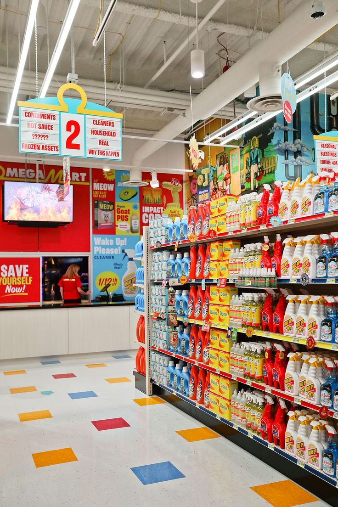

<h1 style="text-align: center;"> Implementation of Streamlit on the Superstore Dataset Dashboard </h1>

The Superstore dataset source can be downloaded via Kaggle: https://www.kaggle.com/datasets/vivek468/superstore-dataset-final or you can download on my repository [Download here!](./Superstore.xlsx).

<h4> Link Dashboard: </h4>
You can see my dashboard on https://dashboard-superstore-project.streamlit.app/

## Definition
Superstore datasets are popular datasets that are often used for data analysis exercises, visualization, and machine learning model development. These datasets typically consist of information related to sales, customers, products, and regions, similar to the data a retail or e-commerce store might have.

## Data Understanding
- Row ID => Unique ID for each row.
- Order ID => Unique Order ID for each Customer.
- Order Date => Order Date of the product.
- Ship Date => Shipping Date of the Product.
- Ship Mode=> Shipping Mode specified by the Customer.
- Customer ID => Unique ID to identify each Customer.
- Customer Name => Name of the Customer.
- Segment => The segment where the Customer belongs.
- Country => Country of residence of the Customer.
- City => City of residence of of the Customer.
- State => State of residence of the Customer.
- Postal Code => Postal Code of every Customer.
- Region => Region where the Customer belong.
- Product ID => Unique ID of the Product.
- Category => Category of the product ordered.
- Sub-Category => Sub-Category of the product ordered.
- Product Name => Name of the Product
- Sales => Sales of the Product.
- Quantity => Quantity of the Product.
- Discount => Discount provided.
- Profit => Profit/Loss incurred.

## How Can We Analyze of this Dataset?
1. **Training Data Cleaning and Preprocessing Skills** -> The Superstore dataset is commonly used to practice data cleaning skills, such as removing duplicate entries, handling missing values, or correcting incorrectly formatted data. This process helps users understand the importance of preparing clean and accurate data before analysis or predictive modeling.
2. **Analyzing Business Performance in Sales and Profitability** -> This dataset enables users to analyze sales trends and profitability across different dimensions, such as product categories, geographic regions, or customer segments. These insights can highlight high-performing areas and pinpoint underperforming ones that require further attention.
3. **Identifying Purchase Patterns and Customer Segmentation** -> By leveraging attributes like region, segment, or product subcategories, the dataset facilitates customer segmentation. This is useful for understanding customer purchasing behavior and designing more targeted marketing strategies or personalized product recommendations.
4. **Practicing Informative Data Visualization** -> The Superstore dataset is ideal for creating engaging and interactive data visualizations using tools like Tableau, Power BI, or Looker Studio. Users can develop dashboards to track sales performance, shipping workflows, or profitability across various dimensions and segments.

                                                                 THANK YOU
<h5> Follow more: </h5>
<h6> My Linkedln: https://www.linkedin.com/in/ferdypput/</h6>
